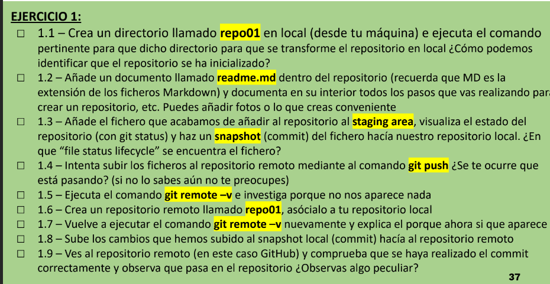
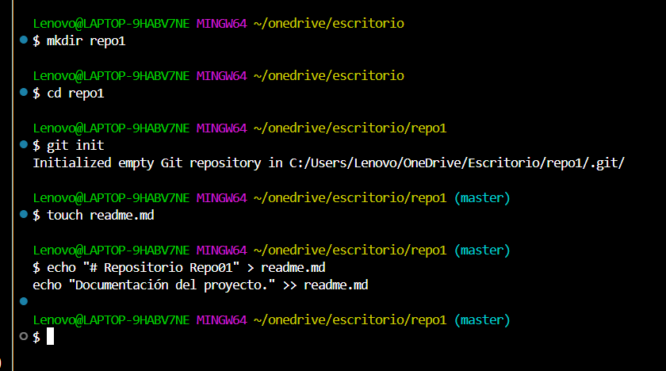
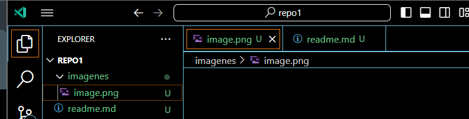
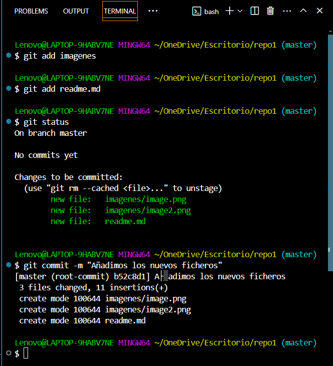
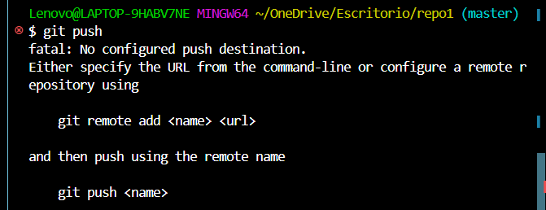
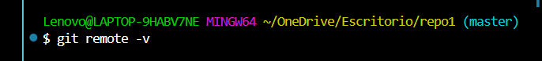
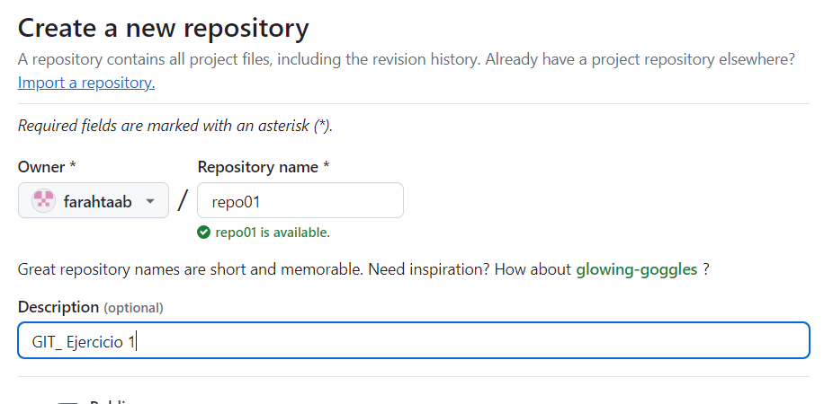
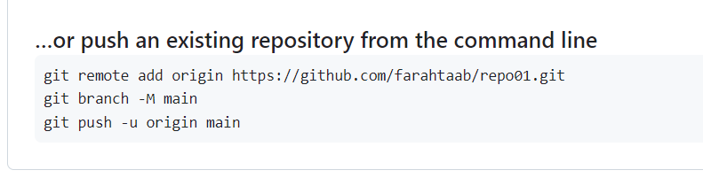
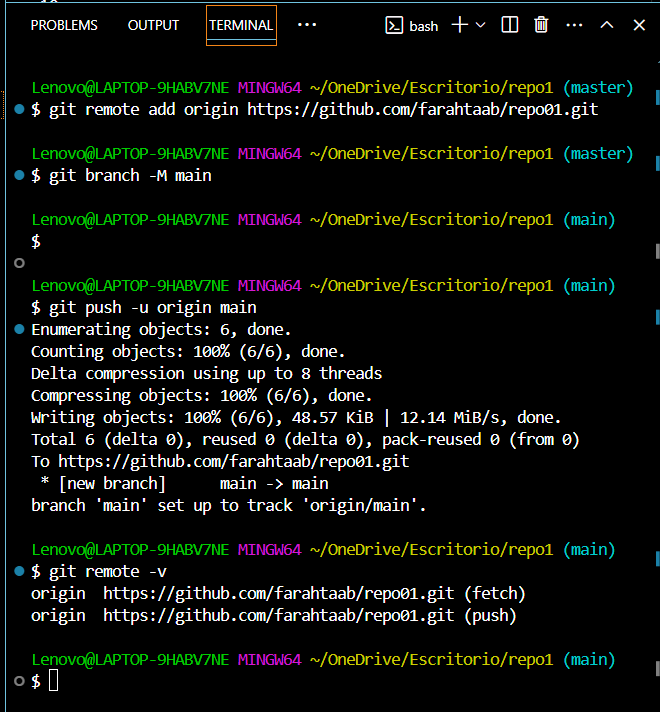
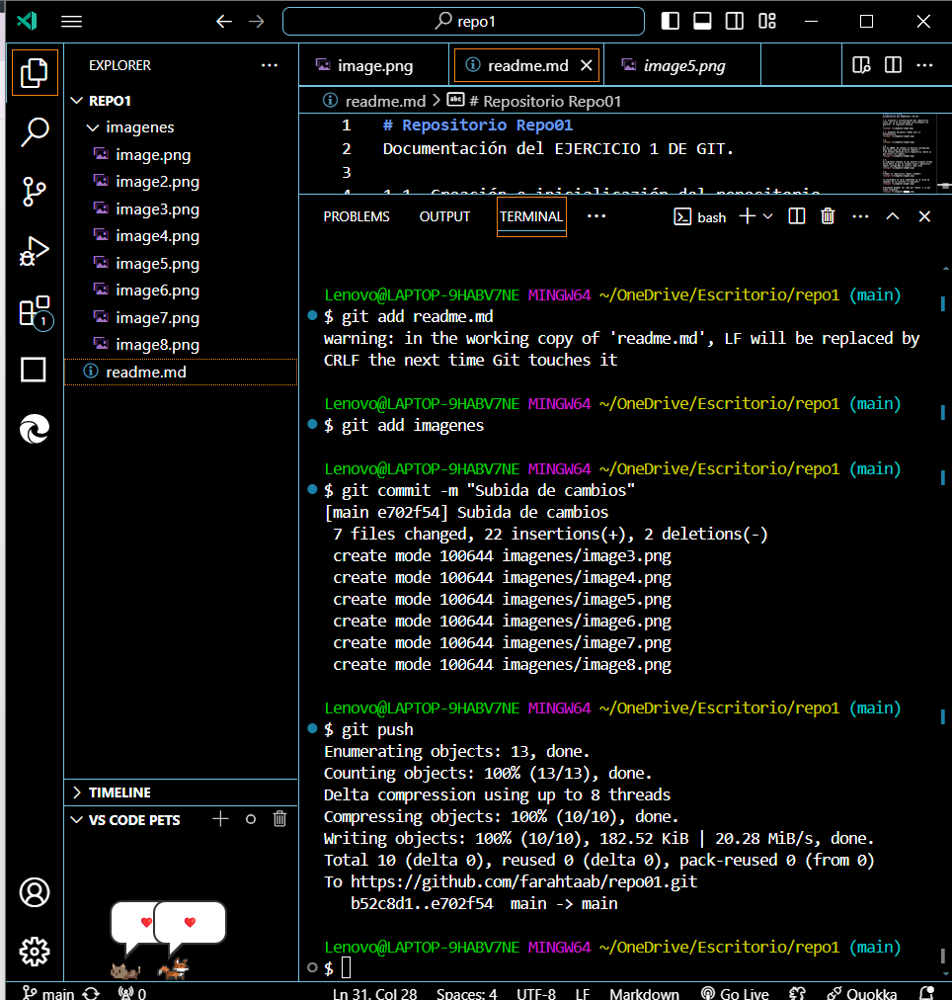

# Repositorio Repo01
Documentación del EJERCICIO 1 DE GIT.
ENUNCIADO ->

1.1_ Creación e inicialicazión del repositorio local (Si se ha inicializado correctamente nos aparecerà el siguiente mensaje
)
<<<<<<< HEAD

1.2_ Añadimos documento readme para la documentación.

1.3_ 

=======

1.2_ Añadimos documento readme para la documentación.

1.3_ 
>>>>>>> c6081043cd3d3436abaabc8bc2f57578d0f099c6

1.4_
Nos da ERROR. No tenemos un destino configurado para hacer push de nuestros cambios!! 
* No tenemos definido ninún repositorio remoto al que enviar los cambios.
<<<<<<< HEAD

=======
>>>>>>> c6081043cd3d3436abaabc8bc2f57578d0f099c6

1.5_
El siguiente comando no nos muestra ninguna salida hasta ahora ya que no tenemos ningún repositorio remoto configurado en nuestro repo local
<<<<<<< HEAD

=======
>>>>>>> c6081043cd3d3436abaabc8bc2f57578d0f099c6

1.6_
Creamos un repositorio remoto (repo01):
<<<<<<< HEAD

Lo vinculamos al local añadiendo en la linia de comandos de la terminal lo siguiente: 

1.7_ Finalmente podemos ver como git remote -v si que tiene respuesta:

1.8_ Subida de los cambios.

=======

Lo vinculamos al local añadiendo en la linia de comandos de la terminal lo siguiente: 

Finalmente podemos ver como git remote -v si que tiene respuesta:

>>>>>>> c6081043cd3d3436abaabc8bc2f57578d0f099c6
